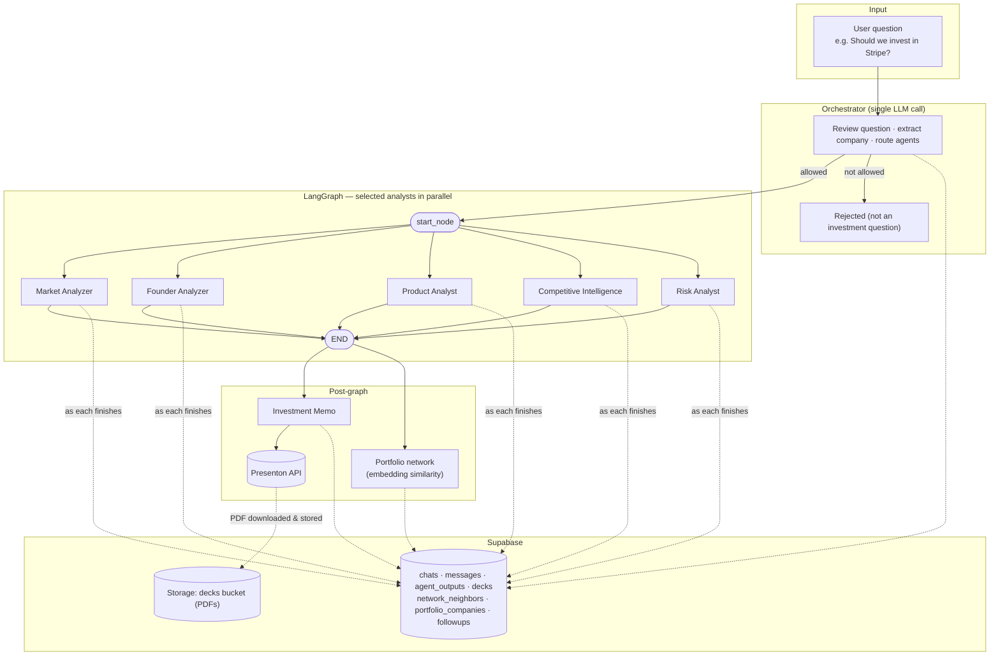

# Archer — AI Investment Committee

Archer is a multi-agent pipeline that researches a company and produces an investment memorandum. Ask it a question like *"Should we invest in Stripe?"* and an orchestrator reviews the question, deploys the analyst agents it actually needs, synthesizes their findings, and delivers a structured memo with a clear recommendation.

A dark-themed **Next.js** web UI streams live agent status as work progresses. Every chat is persisted to **Supabase** — full agent outputs, the generated slide deck, and the portfolio-similarity graph — so past analyses can be reloaded at any time. Watchlist decisions can be scheduled for a follow-up rerun with a Google Calendar reminder.

---

## Updates (since Jun 30, 2026)

1. **Added database** — Supabase persistence for every chat: question, status, and the consolidated analysis are saved per run (`chats`, `messages` tables), with all writes fail-soft so an outage never breaks a live analysis.
2. **Added chat memory UI** — a history sidebar to create new chats and reload any past analysis (agent cards, memo PDF, and network graph reconstructed from the database).
3. **Added per-agent output storage** — each agent's full verbose JSON is saved as its own row (`agent_outputs`) the moment that agent finishes, not just at the end of the run.
4. **Added durable slide-deck storage** — the Presenton memo PDF is downloaded and stored in Supabase Storage (`decks`), so it outlives Presenton's CDN links.
5. **Added network-graph score storage** — the analyzed company's top-10 portfolio neighbours with similarity scores are saved as queryable rows (`network_neighbors`).
6. **Added calendar option (watchlist follow-ups)** — watchlist decisions offer a scheduled rerun: pick a date, get a prefilled Google Calendar reminder link, and on the due date the app prompts to rerun (only with user approval); the rerun becomes a new chat linked to the original (`followups`).
7. **Migrated the frontend to Next.js** — the single-file vanilla JS UI was rebuilt as a Next.js 15 + React 19 + TypeScript app with componentized views, keeping the original design pixel-faithful.
8. **UI polish** — `app_icon.png` is now the logo/avatar/favicon, and the home-screen placeholder rotates through example companies with a rise animation.
9. **Added Risk Analyst agent** — a dedicated committee node covering regulatory exposure, key-person risk, market timing risk, and red flags (lawsuits, layoffs, negative press); its `risk_score` and `red_flags` feed the memo's risks slide and final recommendation.
10. **Added data-retrieval agent (SQL agent)** — the orchestrator now classifies question *intent*; a `retrieve` question (e.g. "which fintech companies have we analyzed?") is answered by a **read-only** ReAct SQL agent that queries the Supabase tables and replies in plain English. Read-only is structural — its tools only ever `.select()`.
11. **Added comparative analysis** — a `compare` question ("Notion vs Airtable", "compare our fintech companies") puts companies the committee has *already analyzed* side by side, from stored data with no fresh research, and renders a scorecard table with a verdict.
12. **Added watchlist revisit diff** — a scheduled watchlist rerun no longer regenerates a deck. It re-researches the company fresh (no memo/PDF), diffs the new analyst output against the original analysis via the comparison agent (`revisit` mode), and streams a "what changed" before/after report straight into the chat.
13. **Added `portfolio_companies` table** — the Summit portfolio corpus (`summit_portfolio_companies.json`) is now a first-class table keyed by the JSON index, and `network_neighbors.neighbor_id` is a foreign key to it. Seed it with `scripts/seed_portfolio_companies.py`.

---

## Agent Architecture

The pipeline is built on **LangGraph**. An **orchestrator** LLM call first reviews the question (guardrail) and classifies its **intent**:

- **`analyze`** — research a company fresh: extract the company, select which analyst agents to run, fan them out in parallel, then run the **Investment Memo** agent (outside the graph) to read all consolidated outputs and generate the Presenton PDF. *(This is the main flow diagrammed below.)*
- **`retrieve`** — answer from the committee's own saved data ("which fintech companies have we analyzed?") via the **read-only SQL agent**, no committee run.
- **`compare`** — put companies already analyzed side by side ("Notion vs Airtable") via the **comparison agent**, from stored data with no fresh research.
- **`off_topic`** — rejected (and still persisted as a `rejected` chat).

A scheduled watchlist **revisit** reuses the `analyze` committee (no memo) and then the comparison agent in `revisit` mode to diff the fresh run against the original.



### Agents

| Agent                        | File                                           | What it does                                                                                                                                                                                                                                                 |
| ---------------------------- | ---------------------------------------------- | ------------------------------------------------------------------------------------------------------------------------------------------------------------------------------------------------------------------------------------------------------------ |
| **Orchestrator**             | `committee/api.py` (`_orchestrate`)            | Single pre-analysis LLM call: classifies the question's intent (`analyze` / `retrieve` / `compare` / `off_topic`), and for an `analyze` question extracts the company name and routes to the analyst subset needed. Its routing decision is persisted to `agent_outputs`.                |
| **Market Analyzer**          | `committee/agents/market_analyzer.py`          | Classifies the company into a market/sector via LLM, then researches that market across six dimensions (TAM/SAM/SOM, CAGR, timing, competitive landscape, regulatory trends, emerging tech). Produces a `market_score` (0–10) with confidence and reasoning. |
| **Founder Analyzer**         | `committee/agents/founder_analyzer.py`         | Identifies founders via web search, deep-dives on backgrounds, previous companies, domain expertise, execution history, and social-media activity. Downloads headshots for the memo deck.                                                                    |
| **Product Analyst**          | `committee/agents/product_analyst.py`          | Resolves the product name via web search, then researches product quality, differentiation, defensibility, technical moat, and roadmap. Produces a `product_score` (0–10).                                                                                   |
| **Competitive Intelligence** | `committee/agents/competitive_intelligence.py` | Finds the top three direct competitors, deep-dives on their funding and revenue, and synthesizes a comparison table and competitive moat assessment.                                                                                                         |
| **Risk Analyst**             | `committee/agents/risk_analyst.py`             | Classifies the company's industry/regulatory domain, then researches its risk surface across six dimensions: regulatory exposure, key-person risk, market timing risk, lawsuits, layoffs, and negative press. Produces a `risk_score` (0–10, higher is safer) plus an explicit `red_flags` list. |
| **Investment Memo**          | `committee/agents/investment_memo.py`          | Consolidates all analyst outputs, drafts an 8-slide memo (title + 6 body + recommendation), and generates a PDF presentation via the Presenton API. Issues a `invest / pass / watchlist` decision.                                                           |
| **SQL Agent** (retrieval)    | `committee/agents/sql_agent.py`                | Read-only ReAct agent for `retrieve` questions. Reads the Supabase tables (via PostgREST `.select()` only — no insert/update/delete/DDL is exposed) through an allowlist of tables and answers in plain English. Powers questions about the committee's own past work. |
| **Comparison Agent**         | `committee/agents/comparison_agent.py`         | Builds a structured side-by-side from *stored* analyses (no re-research). `compare` mode ranks companies and picks a winner; `revisit` mode diffs one company's previous vs. fresh analysis into a "what changed" report for watchlist reruns.                 |


## Memory & Persistence (Supabase)

Every run is durably saved — nothing is ephemeral anymore:

| Table / bucket        | What it holds                                                                                                     |
| --------------------- | ------------------------------------------------------------------------------------------------------------------ |
| `chats`               | One row per analysis: question, company, status (`running/done/rejected/error`), the consolidated `analysis` JSON, and the `network_snapshot` (neighbours + position). |
| `messages`            | The chat transcript (user question, assistant summary).                                                              |
| `agent_outputs`       | One row per agent per chat — each agent's full verbose JSON, written the moment that agent finishes (includes the orchestrator's routing decision). |
| `decks`               | Metadata for the generated memo PDF; the PDF itself is downloaded from Presenton and stored in the public `decks` Storage bucket so it outlives Presenton's CDN links. |
| `network_neighbors`   | The analyzed company's top-10 portfolio neighbours with similarity scores and positions — queryable directly (e.g. "which analyses had Airtable in the top 10"). `neighbor_id` is a foreign key to `portfolio_companies`. |
| `portfolio_companies` | The Summit portfolio corpus (`summit_portfolio_companies.json`), one row per company, keyed by the company's index in the JSON (the same id `network.py` emits as a neighbour). Reference data — seed it once with `scripts/seed_portfolio_companies.py`. |
| `followups`           | Scheduled watchlist reruns: due date, status (`pending/done/dismissed`), and a link to the rerun chat.               |

All persistence is **fail-soft**: a Supabase outage or missing credentials never breaks the live analysis — writes are logged and skipped.

The sidebar lists past chats; clicking one reconstructs the full view (agent cards, PDF viewer pointed at the Supabase-stored deck, network graph) from the database.

### Watchlist follow-ups

When the committee returns a **watchlist** decision, Archer offers to revisit:

1. A "Worth revisiting" card appears with quick presets (2 weeks / 1 month / 3 months) or a custom date.
2. Scheduling stores a `followups` row and provides a prefilled **"Add to Google Calendar"** link (Google's public event-template URL — no OAuth, the app never touches your Google account; the calendar event is your personal reminder).
3. When you open the app on or after the due date, a banner prompts: *"It's time to rerun your research on X."* The rerun only happens after you click **Rerun now**. It re-researches the company with the full committee (**no deck is regenerated**), then diffs the fresh output against the original analysis with the comparison agent (`revisit` mode) and streams a **before/after "what changed" report** into a new chat — linked back to the original via `followups.rerun_chat_id`. A failed rerun does not consume the reminder.

### Portfolio network

`committee/network.py` embeds all Summit portfolio companies (`summit_portfolio_companies.json`, sentence-transformers `all-MiniLM-L6-v2`) into a 2-D PCA layout. After each analysis, the new company is projected into the same space and its top-10 most similar portfolio companies are computed, rendered as an interactive canvas map, and persisted.

---

## Technology Stack

| Layer                   | Technology                                                             |
| ----------------------- | ---------------------------------------------------------------------- |
| Agent orchestration     | [LangGraph](https://github.com/langchain-ai/langgraph) + orchestrator LLM routing |
| LLM calls               | Anthropic Claude via `langchain-anthropic`                             |
| Web research            | [Tavily](https://tavily.com) search API (via `langchain-mcp-adapters`) |
| Structured output       | Pydantic v2 models with field validators                               |
| Presentation generation | Presenton API (PDF stored in Supabase Storage)                         |
| Persistence             | [Supabase](https://supabase.com) (Postgres + Storage), via `supabase-py` |
| Embeddings              | sentence-transformers (`all-MiniLM-L6-v2`) + PCA layout                |
| Web server              | FastAPI + Uvicorn (SSE streaming)                                      |
| Frontend                | Next.js 15 (App Router) + React 19 + TypeScript                        |
| Progress tracking       | Custom `AgentProgress` singleton with registered handlers              |
| Runtime                 | Python 3.11+ (Poetry) · Node 18+ (npm)                                 |


## Running Locally

### Prerequisites

```bash
# Python deps
poetry install

# Frontend deps
cd frontend && npm install && cd ..

# Copy and fill in API keys (Anthropic, Tavily, Presenton, Supabase)
cp .env.example .env
```

### Supabase setup (once)

1. Create a project at [supabase.com](https://supabase.com/dashboard).
2. Run `supabase/schema.sql` in the SQL Editor.
3. Create a **public** Storage bucket named `decks`.
4. Put the Project URL and **service_role** key into `.env` (`SUPABASE_URL`, `SUPABASE_SERVICE_ROLE_KEY`). The key is only read server-side.
5. Seed the portfolio corpus: `poetry run python scripts/seed_portfolio_companies.py` (populates `portfolio_companies`, which `network_neighbors` references).

### Web UI (two dev servers)

```bash
# Terminal 1 — FastAPI backend on :8000
poetry run uvicorn committee.api:app --reload --port 8000

# Terminal 2 — Next.js frontend on :3000 (proxies /api/* to :8000)
cd frontend && npm run dev
```

Open `http://localhost:3000`.

### CLI

```bash
poetry run committee
# → "Should we invest in Stripe?"
```

---

## How a Request Flows

1. The user submits a question in the UI (`POST /api/analyze`, proxied through Next.js) or CLI.
2. The **orchestrator** LLM call reviews the question and classifies its intent. A `retrieve` question is handed to the read-only SQL agent and a `compare` question to the comparison agent (both stream back over the same SSE contract and skip the committee); `off_topic` is rejected (and still persisted as a `rejected` chat). The steps below describe the `analyze` intent — for it the orchestrator also extracts the company and selects the analyst agents.
3. A `chats` row is created; the orchestrator's routing decision is saved to `agent_outputs`. The SSE `start` event tells the UI which agents were deployed.
4. `start_node` fans out to the selected analysts in parallel. Each calls `progress.update_status(...)` as it advances through classify → research → synthesize → done; a registered handler streams these as `agent_update` SSE events **and writes each agent's final JSON to `agent_outputs` the moment it finishes**.
5. When the graph completes, `investment_memo_agent` runs with the consolidated `state["data"]["analysis"]`, drafts slides, and calls Presenton.
6. The company is embedded into the portfolio network; its top-10 neighbours are computed.
7. Everything is persisted: consolidated analysis + network snapshot on the chat row, the deck PDF downloaded into Supabase Storage, neighbours into `network_neighbors`.
8. The API fires a `complete` event. The frontend renders the memo PDF, the recommendation, and the interactive network map — and if the decision is **watchlist**, offers to schedule a follow-up rerun.
