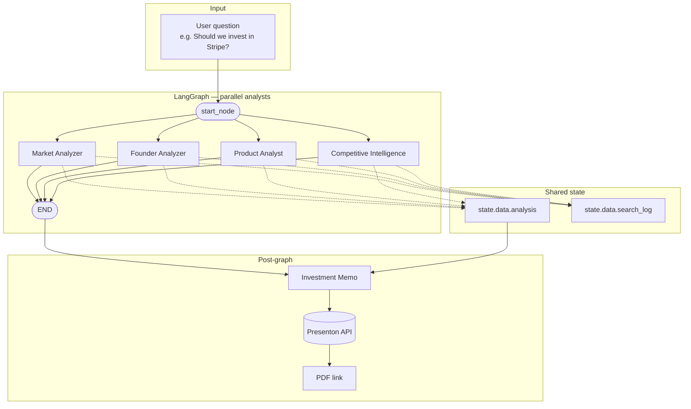

# Archer — AI Investment Committee

Archer is a multi-agent pipeline that researches a company and produces an investment memorandum. Ask it a question like *"Should we invest in Stripe?"* and five specialized agents run in parallel, synthesize their findings, and deliver a structured memo with a clear recommendation.

A dark-themed web UI streams live agent status as work progresses.

---

## Agent Architecture

The pipeline is built on **LangGraph**. Four analyst agents fan out in parallel from a single entry node. When they finish, the **Investment Memo** agent runs separately (outside the graph) so it can read all consolidated outputs and generate the Presenton PDF.

### Network graph



**LangGraph wiring** (`committee/graph.py`):

```
                    ┌──► market_analyzer_agent ──► END
                    │
start_node ─────────┼──► founder_analyzer_agent ──► END
                    │
                    ├──► product_analyst_agent ──► END
                    │
                    └──► competitive_intelligence_agent ──► END

(investment_memo_agent runs after committee.invoke() in main.py / api.py)
```

All four analyst agents run concurrently. Each writes its validated output to `state["data"]["analysis"]`. The Investment Memo agent then consumes that shared state, drafts slides, and calls Presenton for the final deck.

### Agents


| Agent                        | File                                           | What it does                                                                                                                                                                                                                                                 |
| ---------------------------- | ---------------------------------------------- | ------------------------------------------------------------------------------------------------------------------------------------------------------------------------------------------------------------------------------------------------------------ |
| **Market Analyzer**          | `committee/agents/market_analyzer.py`          | Classifies the company into a market/sector via LLM, then researches that market across six dimensions (TAM/SAM/SOM, CAGR, timing, competitive landscape, regulatory trends, emerging tech). Produces a `market_score` (0–10) with confidence and reasoning. |
| **Founder Analyzer**         | `committee/agents/founder_analyzer.py`         | Identifies founders via web search, deep-dives on backgrounds, previous companies, domain expertise, execution history, and social-media activity. Downloads headshots for the memo deck.                                                                    |
| **Product Analyst**          | `committee/agents/product_analyst.py`          | Resolves the product name via web search, then researches product quality, differentiation, defensibility, technical moat, and roadmap. Produces a `product_score` (0–10).                                                                                   |
| **Competitive Intelligence** | `committee/agents/competitive_intelligence.py` | Finds the top three direct competitors, deep-dives on their funding and revenue, and synthesizes a comparison table and competitive moat assessment.                                                                                                         |
| **Investment Memo**          | `committee/agents/investment_memo.py`          | Consolidates all analyst outputs, drafts an 8-slide memo (title + 6 body + recommendation), and generates a PDF presentation via the Presenton API. Issues a `invest / pass / watchlist` decision.                                                           |


### How each agent works

Every agent follows a  same three-step pattern and chooses the tools it needs:

1. **Classify** — an LLM call extracts the specific subject to research (market name, founder names, product name, competitor list).
2. **Research** — Tavily web search runs across multiple dimensions in parallel, gathering evidence from live sources.
3. **Synthesize** — a second LLM call reads the evidence and produces a structured Pydantic output that is validated and range-clamped before leaving the agent.

---

## Technology Stack


| Layer                   | Technology                                                             |
| ----------------------- | ---------------------------------------------------------------------- |
| Agent orchestration     | [LangGraph](https://github.com/langchain-ai/langgraph)                 |
| LLM calls               | Anthropic Claude via `langchain-anthropic`                             |
| Web research            | [Tavily](https://tavily.com) search API (via `langchain-mcp-adapters`) |
| Structured output       | Pydantic v2 models with field validators                               |
| Presentation generation | Presenton API                                                          |
| Web server              | FastAPI + Uvicorn                                                      |
| Frontend                | Vanilla HTML/CSS/JS, streamed via SSE                                  |
| Progress tracking       | Custom `AgentProgress` singleton with registered handlers              |
| Runtime                 | Python 3.11+, managed with Poetry                                      |


---

## Project Structure

```
committee/
  agents/
    market_analyzer.py          # Market sizing and attractiveness
    founder_analyzer.py         # Founding team evaluation
    product_analyst.py          # Product quality and moat
    competitive_intelligence.py # Competitor landscape
    investment_memo.py          # Final memo + PDF generation
  tools/
    tavily_mcp.py               # Tavily search wrapper
    presenton_api.py            # PDF deck generation
    tavily_founder_images.py    # Founder headshot downloader
  graph.py                      # LangGraph workflow definition
  main.py                       # CLI entry point
  api.py                        # FastAPI server + SSE streaming

frontend/
  index.html                    # Archer UI (home, agent status, memo viewer)

src/
  graph/state.py                # Shared AgentState TypedDict
  utils/
    llm.py                      # LLM call helper with Pydantic output
    progress.py                 # AgentProgress singleton
```

---

## Running Locally

### Prerequisites

```bash
# Install dependencies
poetry install

# Copy and fill in API keys
cp .env.example .env
```

### CLI

```bash
poetry run committee
# → "Should we invest in Stripe?"
```

### Web UI

```bash
# Start the backend (serves the frontend at /)
poetry run uvicorn committee.api:app --reload --port 8000
```

Open `http://localhost:8000`.

---

## How a Request Flows

1. The user submits a question in the UI (`POST /api/analyze`) or CLI.
2. The API extracts the company name, opens an SSE stream, and runs the LangGraph committee in a thread pool.
3. `start_node` fans out to all four analyst agents in parallel.
4. Each agent calls `progress.update_status(...)` as it advances through classify → research → synthesize → done.
5. A registered handler pushes those status events onto an asyncio queue; the SSE stream forwards them to the browser as `agent_update` events.
6. When the graph completes, `investment_memo_agent` runs with the consolidated `state["data"]["analysis"]`.
7. The memo agent drafts slides, calls Presenton, and stores the returned PDF URL in `analysis.investment_memo.presentation_url`.
8. The API fires a `complete` event with the full result. The frontend embeds the Presenton PDF via that link.

