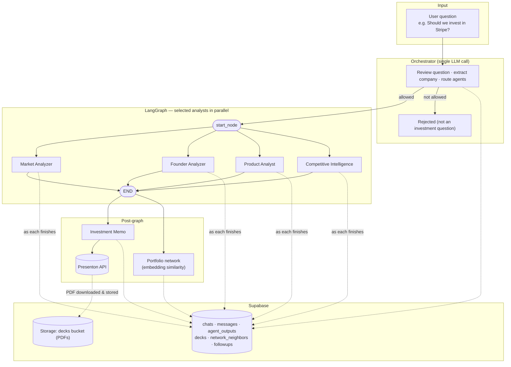

# Archer — AI Investment Committee

Archer is a multi-agent pipeline that researches a company and produces an investment memorandum. Ask it a question like *"Should we invest in Stripe?"* and an orchestrator reviews the question, deploys the analyst agents it actually needs, synthesizes their findings, and delivers a structured memo with a clear recommendation.

A dark-themed **Next.js** web UI streams live agent status as work progresses. Every chat is persisted to **Supabase** — full agent outputs, the generated slide deck, and the portfolio-similarity graph — so past analyses can be reloaded at any time. Watchlist decisions can be scheduled for a follow-up rerun with a Google Calendar reminder.

---

## Updates (since Jun 30, 2026)

1. **Added database** — Supabase persistence for every chat: question, status, and the consolidated analysis are saved per run (`chats`, `messages` tables), with all writes fail-soft so an outage never breaks a live analysis.
2. **Added chat memory UI** — a history sidebar to create new chats and reload any past analysis (agent cards, memo PDF, and network graph reconstructed from the database).
3. **Added per-agent output storage** — each agent's full verbose JSON is saved as its own row (`agent_outputs`) the moment that agent finishes, not just at the end of the run.
4. **Added durable slide-deck storage** — the Presenton memo PDF is downloaded and stored in Supabase Storage (`decks`), so it outlives Presenton's CDN links.
5. **Added network-graph score storage** — the analyzed company's top-10 portfolio neighbours with similarity scores are saved as queryable rows (`network_neighbors`).
6. **Added calendar option (watchlist follow-ups)** — watchlist decisions offer a scheduled rerun: pick a date, get a prefilled Google Calendar reminder link, and on the due date the app prompts to rerun (only with user approval); the rerun becomes a new chat linked to the original (`followups`).
7. **Migrated the frontend to Next.js** — the single-file vanilla JS UI was rebuilt as a Next.js 15 + React 19 + TypeScript app with componentized views, keeping the original design pixel-faithful.
8. **UI polish** — `app_icon.png` is now the logo/avatar/favicon, and the home-screen placeholder rotates through example companies with a rise animation.

---

## Agent Architecture

The pipeline is built on **LangGraph**. An **orchestrator** LLM call first reviews the question (guardrail), extracts the company, and selects which analyst agents to run. The selected analysts fan out in parallel from a single entry node. When they finish, the **Investment Memo** agent runs separately (outside the graph) so it can read all consolidated outputs and generate the Presenton PDF.



**LangGraph wiring** (`committee/graph.py`) — `build_committee(selected_agents)` builds the graph from whatever subset the orchestrator picked:

```
                    ┌──► market_analyzer_agent ──────────► END
                    │
start_node ─────────┼──► founder_analyzer_agent ─────────► END
 (only the          │
  selected          ├──► product_analyst_agent ──────────► END
  agents are        │
  wired in)         └──► competitive_intelligence_agent ─► END

(investment_memo_agent always runs after committee.invoke() in main.py / api.py)
```

A broad question ("Should we invest in X?") runs all four analysts; a narrow one ("How strong are the founders of X?") runs only the relevant agent — the UI shows exactly the rows that were deployed.

### Agents

| Agent                        | File                                           | What it does                                                                                                                                                                                                                                                 |
| ---------------------------- | ---------------------------------------------- | ------------------------------------------------------------------------------------------------------------------------------------------------------------------------------------------------------------------------------------------------------------ |
| **Orchestrator**             | `committee/api.py` (`_orchestrate`)            | Single pre-analysis LLM call: decides whether the question is in scope (investment analysis of a specific company), extracts the company name, and routes to the analyst subset needed. Its routing decision is persisted to `agent_outputs`.                |
| **Market Analyzer**          | `committee/agents/market_analyzer.py`          | Classifies the company into a market/sector via LLM, then researches that market across six dimensions (TAM/SAM/SOM, CAGR, timing, competitive landscape, regulatory trends, emerging tech). Produces a `market_score` (0–10) with confidence and reasoning. |
| **Founder Analyzer**         | `committee/agents/founder_analyzer.py`         | Identifies founders via web search, deep-dives on backgrounds, previous companies, domain expertise, execution history, and social-media activity. Downloads headshots for the memo deck.                                                                    |
| **Product Analyst**          | `committee/agents/product_analyst.py`          | Resolves the product name via web search, then researches product quality, differentiation, defensibility, technical moat, and roadmap. Produces a `product_score` (0–10).                                                                                   |
| **Competitive Intelligence** | `committee/agents/competitive_intelligence.py` | Finds the top three direct competitors, deep-dives on their funding and revenue, and synthesizes a comparison table and competitive moat assessment.                                                                                                         |
| **Investment Memo**          | `committee/agents/investment_memo.py`          | Consolidates all analyst outputs, drafts an 8-slide memo (title + 6 body + recommendation), and generates a PDF presentation via the Presenton API. Issues a `invest / pass / watchlist` decision.                                                           |

### How each agent works

Every analyst agent follows the same three-step pattern and chooses the tools it needs:

1. **Classify** — an LLM call extracts the specific subject to research (market name, founder names, product name, competitor list).
2. **Research** — Tavily web search runs across multiple dimensions in parallel, gathering evidence from live sources.
3. **Synthesize** — a second LLM call reads the evidence and produces a structured Pydantic output that is validated and range-clamped before leaving the agent.

---

## Memory & Persistence (Supabase)

Every run is durably saved — nothing is ephemeral anymore:

| Table / bucket        | What it holds                                                                                                     |
| --------------------- | ------------------------------------------------------------------------------------------------------------------ |
| `chats`               | One row per analysis: question, company, status (`running/done/rejected/error`), the consolidated `analysis` JSON, and the `network_snapshot` (neighbours + position). |
| `messages`            | The chat transcript (user question, assistant summary).                                                              |
| `agent_outputs`       | One row per agent per chat — each agent's full verbose JSON, written the moment that agent finishes (includes the orchestrator's routing decision). |
| `decks`               | Metadata for the generated memo PDF; the PDF itself is downloaded from Presenton and stored in the public `decks` Storage bucket so it outlives Presenton's CDN links. |
| `network_neighbors`   | The analyzed company's top-10 portfolio neighbours with similarity scores and positions — queryable directly (e.g. "which analyses had Airtable in the top 10"). |
| `followups`           | Scheduled watchlist reruns: due date, status (`pending/done/dismissed`), and a link to the rerun chat.               |

All persistence is **fail-soft**: a Supabase outage or missing credentials never breaks the live analysis — writes are logged and skipped.

The sidebar lists past chats; clicking one reconstructs the full view (agent cards, PDF viewer pointed at the Supabase-stored deck, network graph) from the database.

### Watchlist follow-ups

When the committee returns a **watchlist** decision, Archer offers to revisit:

1. A "Worth revisiting" card appears with quick presets (2 weeks / 1 month / 3 months) or a custom date.
2. Scheduling stores a `followups` row and provides a prefilled **"Add to Google Calendar"** link (Google's public event-template URL — no OAuth, the app never touches your Google account; the calendar event is your personal reminder).
3. When you open the app on or after the due date, a banner prompts: *"It's time to rerun your research on X."* The rerun only happens after you click **Rerun now** — it launches a fresh analysis as a new chat, linked back to the original via `followups.rerun_chat_id`. A failed rerun does not consume the reminder.

### Portfolio network

`committee/network.py` embeds all Summit portfolio companies (`summit_portfolio_companies.json`, sentence-transformers `all-MiniLM-L6-v2`) into a 2-D PCA layout. After each analysis, the new company is projected into the same space and its top-10 most similar portfolio companies are computed, rendered as an interactive canvas map, and persisted.

---

## Technology Stack

| Layer                   | Technology                                                             |
| ----------------------- | ---------------------------------------------------------------------- |
| Agent orchestration     | [LangGraph](https://github.com/langchain-ai/langgraph) + orchestrator LLM routing |
| LLM calls               | Anthropic Claude via `langchain-anthropic`                             |
| Web research            | [Tavily](https://tavily.com) search API (via `langchain-mcp-adapters`) |
| Structured output       | Pydantic v2 models with field validators                               |
| Presentation generation | Presenton API (PDF stored in Supabase Storage)                         |
| Persistence             | [Supabase](https://supabase.com) (Postgres + Storage), via `supabase-py` |
| Embeddings              | sentence-transformers (`all-MiniLM-L6-v2`) + PCA layout                |
| Web server              | FastAPI + Uvicorn (SSE streaming)                                      |
| Frontend                | Next.js 15 (App Router) + React 19 + TypeScript                        |
| Progress tracking       | Custom `AgentProgress` singleton with registered handlers              |
| Runtime                 | Python 3.11+ (Poetry) · Node 18+ (npm)                                 |

---

## Project Structure

```
committee/
  agents/
    market_analyzer.py          # Market sizing and attractiveness
    founder_analyzer.py         # Founding team evaluation
    product_analyst.py          # Product quality and moat
    competitive_intelligence.py # Competitor landscape
    investment_memo.py          # Final memo + PDF generation
  tools/
    tavily_mcp.py               # Tavily search wrapper
    presenton_api.py            # PDF deck generation
    tavily_founder_images.py    # Founder headshot downloader
  graph.py                      # LangGraph workflow (accepts agent subsets)
  network.py                    # Portfolio embeddings + similarity graph
  persistence.py                # Supabase writes/reads (fail-soft)
  main.py                       # CLI entry point
  api.py                        # FastAPI server: orchestrator, SSE, chats/followups API

frontend/                       # Next.js app (TypeScript, App Router)
  app/
    layout.tsx                  # Metadata, favicon, global CSS
    globals.css                 # Dark theme (ported from the original UI)
    page.tsx                    # App state machine (reducer over SSE events)
  components/
    Sidebar.tsx                 # Chat history + New chat
    Home.tsx                    # Hero + composer (rotating placeholder)
    ChatView.tsx                # Chat transcript shell
    AgentsCard.tsx              # Live agent rows (orchestrator-filtered)
    PdfSection.tsx              # Memo PDF viewer
    FollowupCard.tsx            # Watchlist scheduling card
    DueBanners.tsx              # Due-rerun prompts
    NetworkPanel.tsx            # Canvas portfolio similarity map
  lib/                          # Typed API client, SSE reader, calendar helpers
  next.config.ts                # Rewrites /api/* to the FastAPI backend

supabase/
  schema.sql                    # All tables + indexes (run once in the SQL Editor)

src/
  graph/state.py                # Shared AgentState TypedDict
  utils/
    llm.py                      # LLM call helper with Pydantic output
    progress.py                 # AgentProgress singleton
```

---

## Running Locally

### Prerequisites

```bash
# Python deps
poetry install

# Frontend deps
cd frontend && npm install && cd ..

# Copy and fill in API keys (Anthropic, Tavily, Presenton, Supabase)
cp .env.example .env
```

### Supabase setup (once)

1. Create a project at [supabase.com](https://supabase.com/dashboard).
2. Run `supabase/schema.sql` in the SQL Editor.
3. Create a **public** Storage bucket named `decks`.
4. Put the Project URL and **service_role** key into `.env` (`SUPABASE_URL`, `SUPABASE_SERVICE_ROLE_KEY`). The key is only read server-side.

### Web UI (two dev servers)

```bash
# Terminal 1 — FastAPI backend on :8000
poetry run uvicorn committee.api:app --reload --port 8000

# Terminal 2 — Next.js frontend on :3000 (proxies /api/* to :8000)
cd frontend && npm run dev
```

Open `http://localhost:3000`.

### CLI

```bash
poetry run committee
# → "Should we invest in Stripe?"
```

---

## How a Request Flows

1. The user submits a question in the UI (`POST /api/analyze`, proxied through Next.js) or CLI.
2. The **orchestrator** LLM call reviews the question, extracts the company, and selects the analyst agents. Off-topic questions are rejected (and still persisted as a `rejected` chat).
3. A `chats` row is created; the orchestrator's routing decision is saved to `agent_outputs`. The SSE `start` event tells the UI which agents were deployed.
4. `start_node` fans out to the selected analysts in parallel. Each calls `progress.update_status(...)` as it advances through classify → research → synthesize → done; a registered handler streams these as `agent_update` SSE events **and writes each agent's final JSON to `agent_outputs` the moment it finishes**.
5. When the graph completes, `investment_memo_agent` runs with the consolidated `state["data"]["analysis"]`, drafts slides, and calls Presenton.
6. The company is embedded into the portfolio network; its top-10 neighbours are computed.
7. Everything is persisted: consolidated analysis + network snapshot on the chat row, the deck PDF downloaded into Supabase Storage, neighbours into `network_neighbors`.
8. The API fires a `complete` event. The frontend renders the memo PDF, the recommendation, and the interactive network map — and if the decision is **watchlist**, offers to schedule a follow-up rerun.
